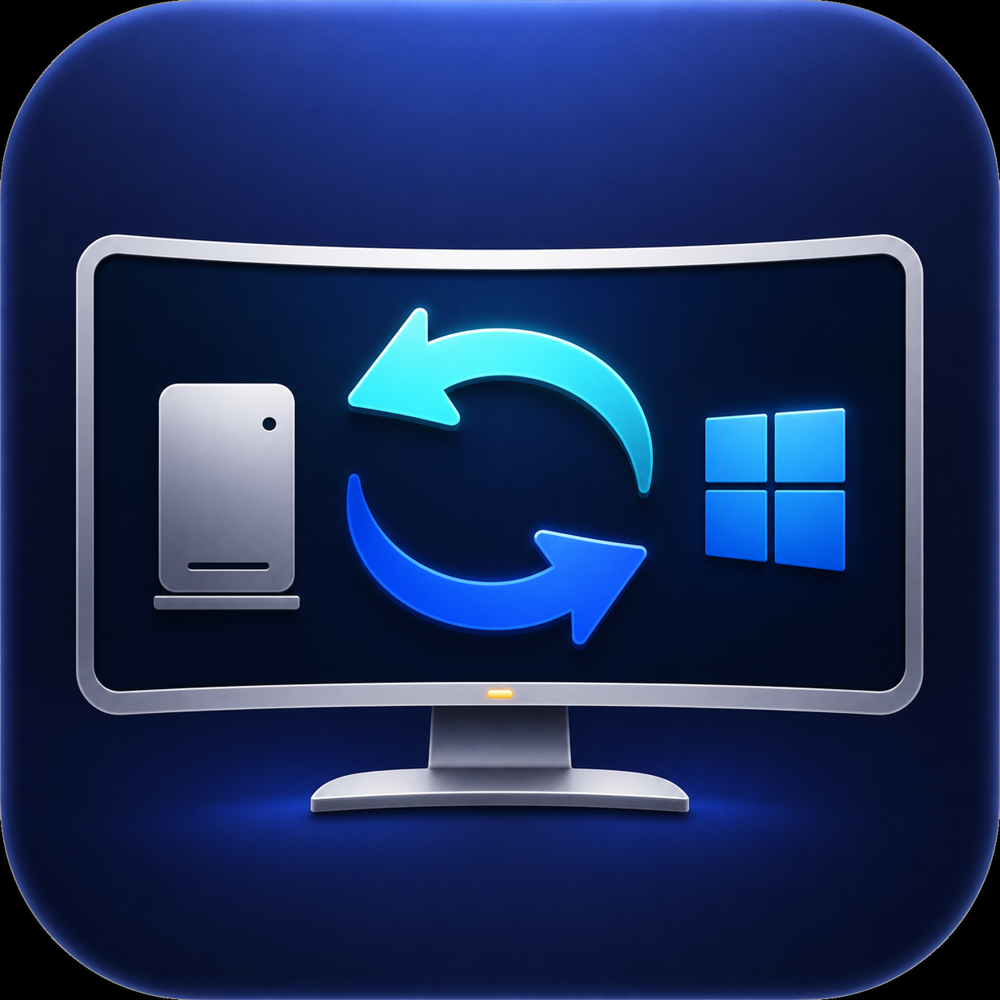

# AOC CU34G2X 双机输入源一键切换

通过 DDC/CI 在共用一台 AOC CU34G2X 显示器的 Mac mini 和 Windows PC
之间一键切换输入源。



当前稳定版：`v1.0.0`。已在 Mac mini（HDMI2）与 Windows PC（DP2）
连接 AOC CU34G2X 的环境中实机验证。

接线配置：

- Mac mini：HDMI2（DDC 值 `0x12`）
- Windows：DP2（DDC 值 `0x10`）
- 输入选择：VCP `0x60`

## 显示器设置

打开 AOC 菜单，将 `Extra → DDC/CI` 设置为 `Yes`。

## Mac：切换到 Windows

1. 安装并启动
   [BetterDisplay](https://github.com/waydabber/BetterDisplay)；本项目使用的
   DDC 输入切换属于其免费功能。
2. 将 `mac/Switch-to-Windows.command` 设为可执行：

   ```shell
   chmod +x mac/Switch-to-Windows.command
   ```

3. 双击该文件即可切换到 Windows，也可以将它放到桌面或 Dock。

## Windows：切换到 Mac

1. 把整个 `windows` 文件夹复制到 Windows。
2. 双击 `Install-Desktop-Shortcut.cmd`。
3. Windows 桌面会出现带图标的“切换到 Mac”；双击它，或者按 `Ctrl+Alt+M`，显示器就会切换到 Mac 的 HDMI2。

Windows 脚本直接调用系统 `Dxva2.dll`，不需要安装 ControlMyMonitor。

如果点击后没有切换，请双击 `Test-Switch-To-Mac.cmd`。测试窗口会保留，
并将显示器枚举、当前 VCP 值和切换结果写入 `last-run.log`。

## 自定义其他接线

本项目默认使用 MCCS VCP `0x60`：

| 输入源 | 值 |
|---|---:|
| DP1 | `0x0F` |
| DP2 | `0x10` |
| HDMI1 | `0x11` |
| HDMI2 | `0x12` |

修改 Mac 脚本中的 `WINDOWS_DP2`，以及 Windows 脚本中的 `$MacHdmi2`，
即可适配其他接线。不同型号显示器的输入值可能不同，请以实际 DDC capabilities
返回结果为准。

## 故障排查

- 确认 DDC/CI 为 `Yes`。
- 避免使用不传递 DDC 信号的转接器或扩展坞。
- 如果 Windows 脚本枚举到多个显示器，它会依次尝试，成功切换后停止。
- 某些显示器固件只允许当前输入对应的电脑发送切换命令，这是正常的；本工具正是两端各自切到另一端。

## 许可证

[MIT](LICENSE)
